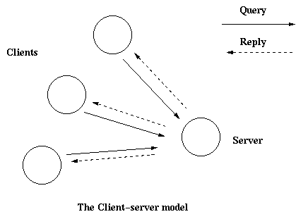

# gen_server 行为

这节应该配合着 `stdlib` 中的手册 [gen_server(3)](http://www.erlang.org/doc/man/gen_server.html)
一起读，所有的接口函数和回调函数都在手册中有详细定义。

## 2.1 客户端-服务端原则

客户端-服务端模型一般由一个中心服务端和一些客户端组成，它被用于资源管理操作。其中，几个不同的客户端
共享一个相同的资源，服务端负责管理这个资源。



*图 2.1： 客户端-服务端模型*

## 2.2 举例

一个用普通 Erlang 写的简单的服务端在 [Overview](./overview.md) 中给出了，那个服务端可以用 `gen_server`
来实现，于是有这个回调函数：

```erlang
-module(ch3).
-behaviour(gen_server).

-export([start_link/0]).
-export([alloc/0, free/1]).
-export([init/1, handle_call/3, handle_cast/2]).

start_link() ->
    gen_server:start_link({local, ch3}, ch3, [], []).

alloc() ->
    gen_server:call(ch3, alloc).

free(Ch) ->
    gen_server:cast(ch3, {free, Ch}).

init(_Args) ->
    {ok, channels()}.

handle_call(alloc, _From, Chs) ->
    {Ch, Chs2} = alloc(Chs),
    {reply, Ch, Chs2}.

handle_cast({free, Ch}, Chs) ->
    Chs2 = free(Ch, Chs),
    {noreply, Chs2}.
```

代码在下边的几节被解释。

## 2.3 启动一个 Gen_Server

在上一节的例子当中，`gen_server` 通过调用 `ch3:start_link()` 来启动：

```erlang
start_link() ->
    gen_server:start_link({local, ch3}, ch3, [], []) => {ok, Pid}
```

start_link 调用函数 `gen_server:start_link/4`，这个函数衍生并且连接到一个新的进程，一个 `gen_server`。

  * 第一个参数 `{local, ch3}` 指定了名字，`gen_server` 被本地注册为 ch3。

    如果名字被省去的话，`gen_server` 不会被注册，而它的 pid 必须被使用。名字也能够用 `{global, Name}`，
    这时 `gen_server` 会用 `global:register_name/2` 来注册。

  * 第二个参数 `ch3` 是回调模块的名字，也就是回调函数在的模块。

    接口函数（`start_link`，`alloc` 和 `free`）和回调函数（`init`，`handle_call` 和
    `handle_cast`）在同一个模块中。把和一个进程相关的函数放在同一个模块中，通常是好的编程实践。

  * 第三个参数 `[]` 是用来之后传递到回调函数 `init` 的一个变量。在这段代码中，`init` 不需要任何
    传入的数据，所以忽略这个参数。

  * 第四个参数 `[]` 是一个参数的队列，去 `gen_server(3)` 手册查看更多的说明。

如果名字注册成功，新的 `gen_server` 进程会调用回调函数 `ch3:init([])`。 `init` 被期望返回 `{ok, State}`，
这里的 `State` 是 `gen_server` 的内部状态。这个例子中，状态是可用的信道。

```erlang
init(_Args) ->
    {ok, channels()}.
```

`gen_server:start_link` 是同步的，直到 `gen_server` 被初始化完并且可以接受请求时，它才会返回。

如果 `gen_server` 是监督树的一部分（被一个监督者启动），那么 `gen_server:start_link` 必须被使用。
还有另外一个函数 `gen_server:start` 用来启动一个单独的 `gen_server`，也就是说这个 `gen_server`
不是监督树的一部分。

## 2.4 同步请求 - Call

下边这个同步请求是用 `gen_server:call/2` 来实现的：
```erlang
alloc() ->
    gen_server:call(ch3, alloc).
```

`ch3` 是`gen_server` 的名字，并且要和用来启动的名字一致，`alloc` 是实际的请求。

请求被做成了一个消息，并被送到 `gen_server`。当请求被收到时，`gen_server` 会调用
`handle_call(Request, From, State)`，它被期望返回一个 `{reply,Reply,State1}` 的元组。
`Reply` 是被发送给客户端的回复，`State1` 是 `gen_server` 状态的一个新值。

```erlang
handle_call(alloc, _From, Chs) ->
    {Ch, Chs2} = alloc(Chs),
    {reply, Ch, Chs2}.
```

在这个例子中，回复是被分配的信道 `Ch`，新的状态是剩下的可用信道的集合 `Chs2`。

所以，`ch3:alloc()` 调用返回分配的信道 `Ch`，`gen_server` 带着一列更新后的可用信道，然后等待新的请求。
