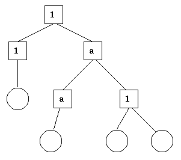

# 总览

**OTP 设计原则** 描述了如何从进程、模块和目录的方面来组织 Erlang 的代码。

## 1.1 监督树

Erlang/OTP 的一个基本概念就是 **监督树(supervision tree)**。它是一个基于 **工作者(workers)** 和 **监督者(supervisors)** 的进程组织模型：

  * 工作者是执行计算的进程，也就是说，它们做实际的工作
  * 监督者是监控工作者行为的进程，一个监督者能够在一个工作者出错时重启它。
  * 监督树是把代码分成监督者和工作者的层级排列，这让我们能够设计和编写出容错的软件。

下边这个图中，方形代表监督者，圆形代表了工作者：



*图 1.1：监督树*

## 1.2 行为

在监督树中，许多进程有相似的结构，它们遵循相似的模式。比如，监督者在结构上是相似的，它们之间唯一的区别是它们监督的子进程。
许多工作者是服务端-客户端关系、有限状态机或者事件处理器（比如错误日志记录器）这样的服务器。

**行为（Behaviours）** 是这些常见模式的规范化。思路就是把一个进程的代码分为通有部分（行为模块）和具体部分（回调模块）。

下边这个例子说明了，代码怎样能够被划分为通有部分和具体部分。考虑这段写了一个简单的服务器的代码（用普通的 Erlang 写的），
它记录了很多 “信道”，其他进程能够通过调用函数 `alloc/0` 和 `free/1` 来分配或者释放 “信道”。

```erlang
-module(ch1).
-export([start/0]).
-export([alloc/0, free/1]).
-export([init/0]).

start() ->
    spawn(ch1, init, []).

alloc() ->
    ch1 ! {self(), alloc},
    receive
        {ch1, Res} ->
            Res
    end.

free(Ch) ->
    ch1 ! {free, Ch},
    ok.

init() ->
    register(ch1, self()),
    Chs = channels(),
    loop(Chs).

loop(Chs) ->
    receive
        {From, alloc} ->
            {Ch, Chs2} = alloc(Chs),
            From ! {ch1, Ch},
            loop(Chs2);
        {free, Ch} ->
            Chs2 = free(Ch, Chs),
            loop(Chs2)
    end.
```

服务器的代码能被重写成一个通用部分 `server.erl`：

```erlang
-module(server).
-export([start/1]).
-export([call/2, cast/2]).
-export([init/1]).

start(Mod) ->
    spawn(server, init, [Mod]).

call(Name, Req) ->
    Name ! {call, self(), Req},
    receive
        {Name, Res} ->
            Res
    end.

cast(Name, Req) ->
    Name ! {cast, Req},
    ok.

init(Mod) ->
    register(Mod, self()),
    State = Mod:init(),
    loop(Mod, State).

loop(Mod, State) ->
    receive
        {call, From, Req} ->
            {Res, State2} = Mod:handle_call(Req, State),
            From ! {Mod, Res},
            loop(Mod, State2);
        {cast, Req} ->
            State2 = Mod:handle_cast(Req, State),
            loop(Mod, State2)
    end.
```

和一个回调模块 `ch2.erl`：

```erlang
-module(ch2).
-export([start/0]).
-export([alloc/0, free/1]).
-export([init/0, handle_call/2, handle_cast/2]).

start() ->
    server:start(ch2).

alloc() ->
    server:call(ch2, alloc).

free(Ch) ->
    server:cast(ch2, {free, Ch}).

init() ->
    channels().

handle_call(alloc, Chs) ->
    alloc(Chs). % => {Ch,Chs2}

handle_cast({free, Ch}, Chs) ->
    free(Ch, Chs). % => Chs2
```

注意如下几点：

  * `server` 中的代码能够被重用来构建许多不同的服务器。
  * 服务器的名字，也就是这个例子中的 atom `ch2`，会从客户端函数的使用者中被隐藏。这意味着，这个名字可以在不影响功能的情况下被修改。
  * 协议（传给服务器和被接受的消息）也被隐藏了，这是好的编程实践，允许我们修改协议，而不会修改使用接口函数的代码。
  * `server` 的功能能够在不改变 `ch2` 或者其他任何回调模块的情况下被拓展。

在上边的 `ch1.erl` 和 `ch2.erl` 中，`channels/0`，`alloc/1` 和 `free/2` 的实现已经被有意地省略了，因为这跟这个例子没有关系。
为了完整性，这些函数的一种写法在下边给出了。这只是一个实例，一个真实的实现必须能够处理一些情况，像没有信道分配等等。

```erlang
channels() ->
   {_Allocated = [], _Free = lists:seq(1,100)}.

alloc({Allocated, [H|T] = _Free}) ->
   {H, {[H|Allocated], T}}.

free(Ch, {Alloc, Free} = Channels) ->
   case lists:member(Ch, Alloc) of
      true ->
         {lists:delete(Ch, Alloc), [Ch|Free]};
      false ->
         Channels
   end.
```

不用 behaviours 写的代码可能更有效率，但增加的效率是以牺牲了通用性为代价的，能够用一种统一的方式来管理所有应用的能力是重要的。

使用 behaviours 也能够使读懂别人的代码更加容易，而临时的编程结构，尽管可能更有效率，但总是更难理解。

`server` 模块简单说来和 Erlang/OTP 的 `gen_server` 行为相当。

标准的 Erlang/OTP 行为是：

  * [gen_server](./gen_server.md)

    用来实现一个客户端-服务端关系的服务端部分

  * [gen_fsm](./gen_fsm.md)

    用来实现有限状态机

  * [gen_event](./gen_event.md)

    用来实现事件处理功能

  * [supervisor](./supervisor.md)

    用来实现监督树中的监督者

编译器知道模块属性 `-behaviour(Behaviour)` 并能够警告缺少的回调函数，比如：

```erlang
-module(chs3).
-behaviour(gen_server).
...

3> c(chs3).
./chs3.erl:10: Warning: undefined call-back function handle_call/3
{ok,chs3}
```

## 1.3 应用

Erlang/OTP 包含了许多组件，每个都实现了一些特定功能。这些组件用 Erlang/OTP 的术语来说就是 **应用(applications)**。
例如，Erlang/OTP 的应用有 Mnesia 和 Debugger，前者有编写数据库服务需要的一切，后者可以用来调试 Erlang 程序。
基于 Erlang/OTP 的最小的程序会有这两个应用：

  * Kernel - 用来运行 Erlang 的必要功能
  * STDLIB - Erlang 标准库

应用的概念包括程序结构（进程）和目录结构（模块）。

最简单的应用可以没有任何进程，只是由一些函数模块组成。这样的应用叫 **库程序(library application)**，比如说 STDLIB。

一个包含进程的应用，最简单可以用标准行为来实现成为一个监督树。

[Applications](./applications.md) 中描述了怎样编写应用。

## 1.4 发布

**发布(release)** 是一个由一些 Erlang/OTP 的应用和用户自定义的应用所组成的完整的系统。

[Releases](./releases.md) 中描述了如何编写发布。

如何在指定环境中安装发布，在第二节系统原则中关于目标系统的那节中有描述。

## 1.5 发布处理

**发布处理(Release Handling)** 是在一个发布的不同版本中升级或降级，而且（可能）是在一个运行中的环境。
这部分在 [Release Handling](./release_handling.md) 中描述。
